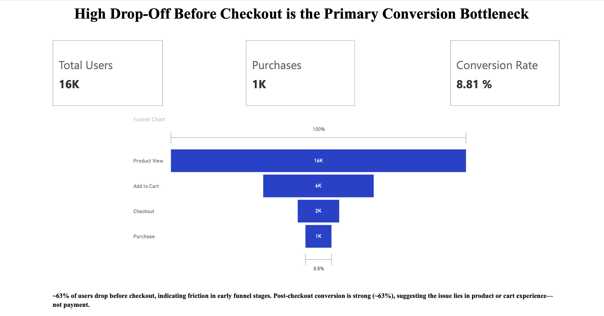
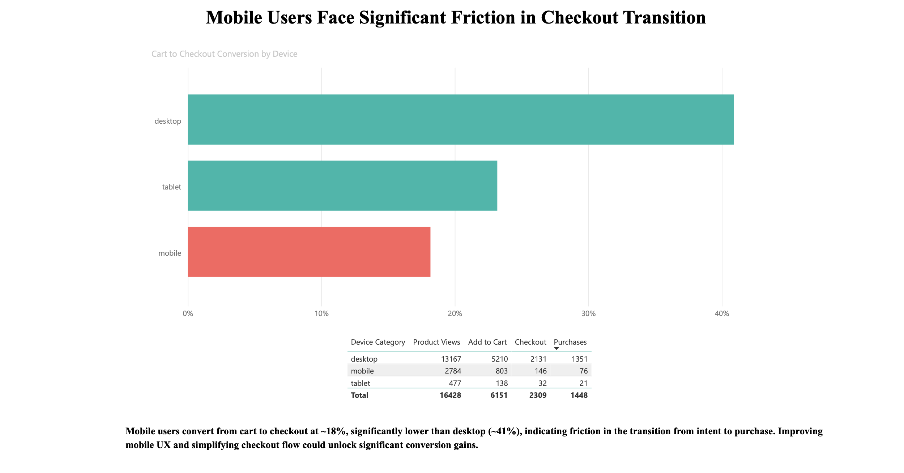
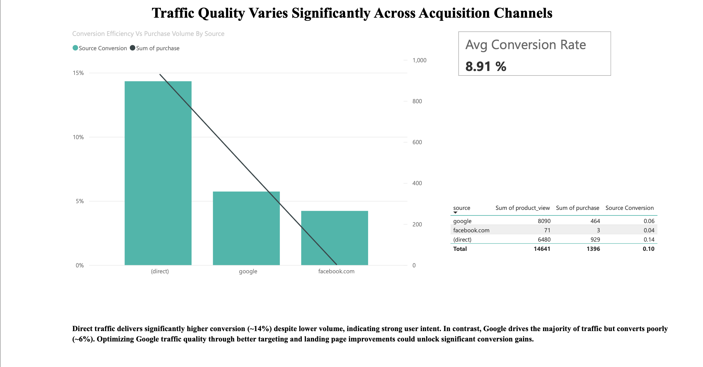

#  E-Commerce Conversion Funnel & Traffic Quality Analysis

---

##  Overview

This project analyzes user behavior across an e-commerce funnel to identify:

* Conversion bottlenecks
* Device-level friction
* Traffic acquisition inefficiencies

Using real-world data from Google Analytics, the goal is to answer:

> **Where are users dropping off, why is it happening, and what actions will drive the highest revenue impact?**

---

##  Dataset

* Source: **Google Analytics Sample Dataset (BigQuery Public Data)**
* Table: `bigquery-public-data.google_analytics_sample.ga_sessions_*`
* Time Period: Aug 2016 – Sep 2016
* Data Size: ~675K event-level records

---

## Tech Stack

* **SQL (BigQuery)** → Data extraction & transformation
* **Power BI** → Dashboard visualization
* **DAX** → KPI calculations

---

##  Data Extraction (SQL)

### 1. Event-Level Funnel Data

```sql
SELECT
  device.deviceCategory,
  trafficSource.source,
  COUNTIF(hits.eCommerceAction.action_type = 2) AS product_view,
  COUNTIF(hits.eCommerceAction.action_type = 3) AS add_to_cart,
  COUNTIF(hits.eCommerceAction.action_type = 5) AS checkout,
  COUNTIF(hits.eCommerceAction.action_type = 6) AS purchase
FROM
  `bigquery-public-data.google_analytics_sample.ga_sessions_*`,
  UNNEST(hits) AS hits
WHERE
  _TABLE_SUFFIX BETWEEN '20160801' AND '20160916'
GROUP BY device.deviceCategory, trafficSource.source
```

---

## Dashboard Preview

### 🔹 Funnel Overview



### 🔹 Device Analysis



### 🔹 Source Analysis



---

## Dashboard Structure

---

### Page 1 — Funnel Overview

* Funnel: Product View → Add to Cart → Checkout → Purchase
* KPIs:

  * Total Users (~16K)
  * Purchases (~1.4K)
  * Conversion Rate (~8.8%)

**Insight:**

> ~63% of users drop before checkout, indicating friction in early funnel stages.

---

### Page 2 — Device Analysis

* Metric: Cart → Checkout Conversion

```DAX
Cart_to_Checkout = checkout / add_to_cart
```

**Insight:**

> Mobile conversion (~18%) is significantly lower than desktop (~41%), indicating UX friction in checkout flow.

---

### Page 3 — Source Analysis

* Combo Chart:

  * Bars → Conversion Rate
  * Line → Purchase Volume

**Insight:**

> Direct traffic converts ~2.5× better than Google, highlighting differences in user intent and traffic quality.

---

## Key Insights

### 1. Funnel Drop-Off

* ~63% users drop before checkout
* Indicates friction in product/cart stage

---

### 2. Device-Level Friction

* Mobile underperforms significantly
* Conversion gap: Desktop vs Mobile

---

### 3. Traffic Quality Gap

* Google → high traffic, low conversion
* Direct → lower traffic, high conversion

---

## 🧩 Business Case Framework

---

### Problem

Despite strong traffic, conversion remains low (~8.8%), indicating inefficiencies in user journey and acquisition strategy.

---

### Root Causes

1. Early funnel friction
2. Mobile UX inefficiencies
3. Low-quality traffic from acquisition channels

---

### Recommendations

#### 1. Improve Mobile Checkout

* Simplify forms
* Reduce steps
* Improve load speed

---

#### 2. Optimize Early Funnel

* Improve product clarity
* Enhance CTA visibility
* Reduce decision friction

---

#### 3. Improve Traffic Quality

* Optimize Google targeting
* Improve landing pages
* Focus on high-intent channels

---

##  Business Impact

* Potential 20–30% uplift in conversion rate
* Improved marketing ROI
* Revenue growth without increasing traffic

---

## Key Takeaway

> **Improving conversion efficiency is a more powerful growth lever than increasing traffic volume.**

---

## 📎 How to Reproduce

1. Run SQL queries in BigQuery
2. Export results as CSV
3. Load into Power BI
4. Build visuals and measures

---

## 👤 Author

**Sahil Narula**

---
